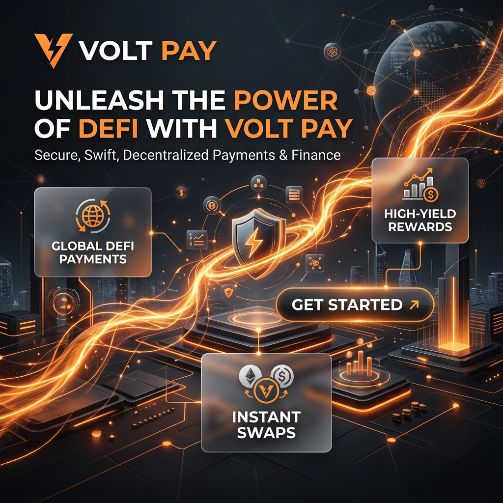
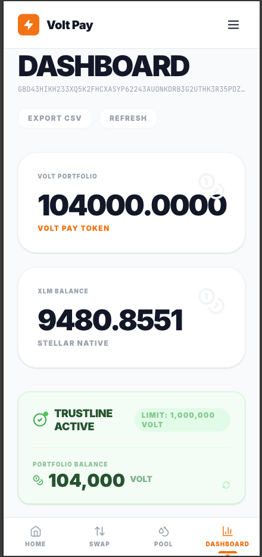
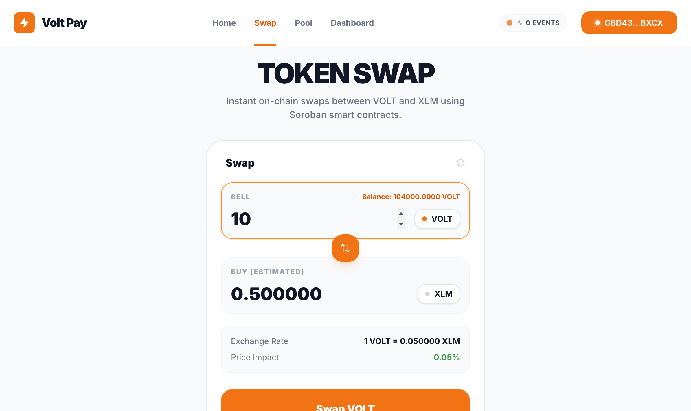
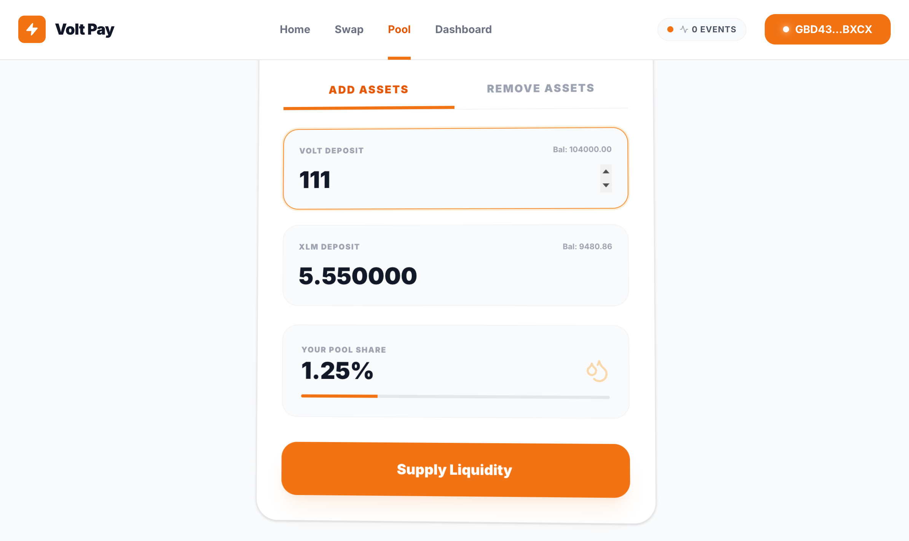

# ⚡️ Volt Pay



Volt Pay is a high-performance, decentralized finance (DeFi) platform built on the **Stellar Soroban** smart contract ecosystem. Experience secure, swift, and low-cost payments and asset swaps with a premium, motion-rich interface.

## 🚀 Live Demo

[Visit Volt Pay](https://voltpay-rust.vercel.app)

## 🎥 Video Walkthrough


## ✨ Core Features

### 🏦 Dashboard & Portfolio
Monitor your assets in real-time. View your XLM and VOLT balances with high-fidelity animated charts and a modern dark-mode aesthetic.



### 🔄 Instant Swaps
Swap between XLM and VOLT instantly using our automated market maker (AMM) pools. Powered by Soroban's efficient smart contract execution.



### 💧 Liquidity Pools
Provide liquidity to the protocol and earn a share of every swap fee. Our dynamic APY engine ensures competitive rewards for LPs.



## 🛠 Tech Stack

- **Framework**: Next.js 14 (App Router)
- **Styling**: Vanilla CSS + Framer Motion
- **Blockchain**: Stellar Soroban (Rust Contracts)
- **Wallet**: Freighter API (v6+)
- **State Management**: SWR (Real-time Polling)

## 📦 Project Structure

```bash
├── contracts/      # Soroban Smart Contracts (Rust)
├── frontend/       # Next.js Application
├── public/assets/  # Project Screenshots & Branding
├── scripts/        # Deployment & Test Scripts
└── vercel.json     # Vercel Deployment Config
```

## 🔐 Security & Reliability

Volt Pay is built with security as a priority:
- **SAC Integration**: Uses the Soroban Asset Connector for seamless classic Stellar asset integration.
- **Fail-safe Build**: Production-hardened build process with fallback contract ID validation.
- **Type-Safe**: Full TypeScript implementation across the frontend.

---

Built with ❤️ for the Stellar Community.
